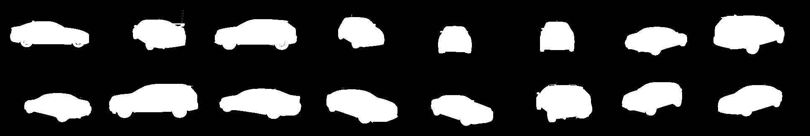
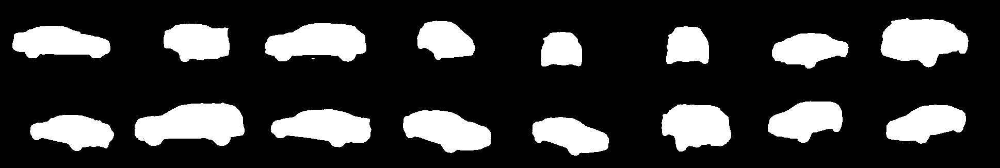

# U-Net Segmentation from Scratch 🧠


This is a deep learning project for binary image segmentation using a U-Net model built from scratch with PyTorch.

The project includes:
- ✅ A custom implementation of the U-Net architecture  
- 📦 Dataset loading and preprocessing with Albumentations  
- 🛠️ A full training pipeline with validation and metrics  
- 🧪 Inference code to predict masks for unseen images

---

## 🎯 Competition Source  
This project was built using the dataset from the [Carvana Image Masking Challenge on Kaggle](https://www.kaggle.com/competitions/carvana-image-masking-challenge).

---

## ⚙️ Training Setup

Due to hardware limitations (Mac M1 Air), the images were resized from their original resolution to **240x160** during training and inference.  
Despite the downscaling, the model achieved strong results:

- **Accuracy:** 99.44%  
- **Dice Score:** 0.986  

> 📌 *Note:* You can increase the image size (e.g. 512x512 or original size) for even better performance on higher-end machines.

---
## 🖼️ Sample Predictions

Here are some example predictions generated by the model:

| Ground Truth  | Predicted Mask |
|-------------|----------------|
|  | |


> You can find all predicted masks inside the `saved_images/` folder after running `predict.py`.
--
## 📁 Folder Structure

Here's a quick overview of the main files and folders in the project:

```bash

├── data/                         # Folder containing training and validation images & masks
│   ├── train/
│   ├── train_masks/
│   ├── data_validation/
│   └── data_validation_masks/
├── saved_images/                # Output folder for predicted masks
├── Model.py                     # U-Net model architecture
├── dataset.py                   # Custom Dataset class
├── train.py                     # Training pipeline
├── test.py                      # Evaluation or prediction script
├── utils.py                     # Helper functions (metrics, plotting, etc.)
├── requirements.txt             # Python dependencies
```

## 🔗 Pretrained Weights

Download the pretrained model checkpoint here: [Google Drive link](https://drive.google.com/file/d/1vhwpv_wTyPrgY_KHs4jMepkcNRaUlvwR/view?usp=share_link) 


## 📦 Dataset

You can download the dataset required for training and validation from the link below:  👉 [Download Dataset from Google Drive](https://drive.google.com/file/d/1H3MWmNQTnY3nssauDrntniGEhkTMk_eD/view?usp=share_link)

> 💡 Make sure to extract the dataset and place it in the `data/` directory.

## 🚀 How to Run

1. **Install dependencies**
```bash
pip install -r requirements.txt
```

2. **Train the model**
```bash
python train.py
```
3. **Run inference on test image**
```bash
python test.py
```
4. **Output**
  🖼️ The predicted masks will be saved in the saved_images/ folder

## 💬 Notes
	•	The model uses BCEWithLogitsLoss for binary segmentation.
	•	Mixed precision training (AMP) is supported for faster training on GPUs.
	•	Image augmentation is applied using Albumentations.


